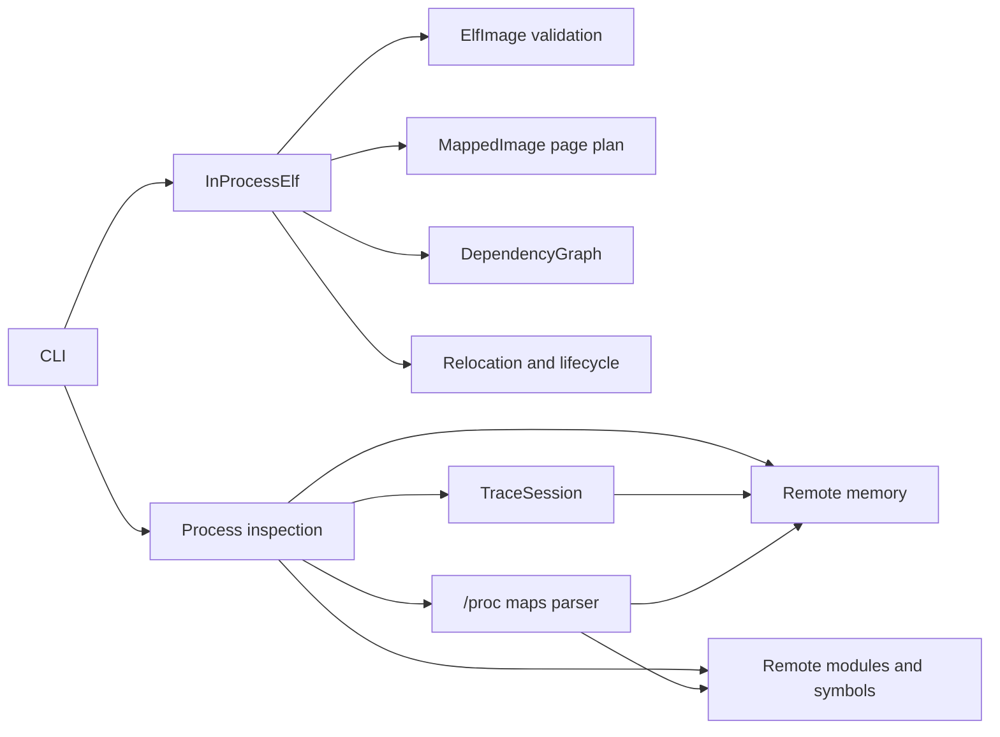

# elf-loader

A Linux x86_64 ELF toolkit that combines a validated in-process `ET_DYN`
relocator with process inspection, thread-group tracing, remote-memory access,
module inventory, and file-backed dynamic-symbol resolution.

The project is intentionally broader than a minimal loader demonstration. Its
core paths are exercised with synthetic ELF fixtures, malformed-input tests,
owned-process integration tests, lifecycle stress, ASan, and UBSan.

## Status

The current implementation is Linux- and x86_64-specific. It is an active ELF
engineering project, not a complete replacement for glibc `ld.so`, GDB, LLDB,
or the kernel's process-debugging interfaces.

Verified functionality includes:

- validated ELF64 little-endian `ET_DYN` parsing;
- in-process mapping, relocation, initialization, and deterministic teardown;
- read-only process metadata and mapping inspection;
- complete discovered-thread-group ptrace stops;
- exact remote-memory reads and writes;
- mapped ELF module inventory and file-backed dynamic-symbol resolution;
- supervised child-process execution with deadlines;
- release stress tests and ASan/UBSan gates.

See [Supported contract](#supported-contract) and
[Known boundaries](#known-boundaries) before using the project with arbitrary
ELF files or processes.

## Features

### ELF validation and relocation

- Validates ELF magic, class, endianness, machine, type, header sizes, program
  headers, segment file bounds, alignment, and virtual-address arithmetic.
- Rejects writable-executable `PT_LOAD` pages, `DT_TEXTREL`, unterminated dynamic
  tables and strings, malformed relocation metadata, and dynamic ranges without
  file backing.
- Supports RELA and packed RELR relocations.
- Supports GNU and SysV dynamic symbol hashes.
- Supports GNU symbol version requirements through `DT_VERSYM`, `DT_VERNEED`,
  and `dlvsym`.
- Supports local GNU IFUNC resolution and delegated dependency TLS.
- Registers and deregisters C++ unwind metadata through libgcc.
- Runs constructors in forward order and destructors in reverse order.

### Mapping invariants

- Reserves the complete image span with `PROT_NONE`.
- Builds per-page protection plans.
- Uses temporary writable mappings only while copying and relocating.
- Enables executable pages before invoking IFUNC resolvers without creating W+X
  mappings.
- Applies final segment protections and seals GNU RELRO read-only.

### Dependency and symbol model

- Recursively discovers `DT_NEEDED` dependencies.
- Expands `$ORIGIN` in RUNPATH/RPATH entries.
- Searches RUNPATH/RPATH, `LD_LIBRARY_PATH`, the parent directory, and standard
  library roots.
- Deduplicates dependency nodes by canonical path and SONAME.
- Builds breadth-first lookup scope and handles dependency cycles.
- Implements strong-over-weak selection and hidden/internal filtering in the
  standalone symbol resolver.

### Process inspection and control

- Reads PID, UID, state, name, and executable from `/proc/<PID>`.
- Parses `/proc/<PID>/maps` into typed mapping records.
- Inventories file-backed mapped ELF modules and computes load bias.
- Resolves file-backed dynamic symbols to remote virtual addresses.
- Enumerates `/proc/<PID>/task` and stops every discovered thread with
  `PTRACE_SEIZE` plus `PTRACE_INTERRUPT`.
- Detaches all seized threads on normal completion and failure paths.
- Validates remote-memory ranges and map permissions before access.
- Prefers `process_vm_readv` and `process_vm_writev`; falls back to ptrace word
  operations when the fast backend transfers no bytes.
- Preserves neighboring bytes for unaligned ptrace writes and attempts rollback
  if a later word write fails.
- Starts and supervises owned process groups with timeout and exit-status
  propagation.

## Requirements

- Linux
- x86_64
- C++20 compiler (`g++` by default)
- GNU Make
- glibc-compatible dynamic-linker interfaces for `dlvsym`, `dlinfo`, and the
  tested TLS behavior
- A kernel providing ptrace; `process_vm_readv`/`process_vm_writev` are optional
  because ptrace fallback exists

Ubuntu CI installs:

```bash
sudo apt-get update
sudo apt-get install -y g++ make binutils
```

## Build

```bash
make
```

Artifacts:

```text
build/elf-loader
build/fixtures/libtarget.so
build/fixtures/libfixturedep.so
build/fixtures/libdiamond_root.so
```

Use another compiler by overriding `CXX`:

```bash
make clean
make CXX=clang++
```

The normal build uses:

```text
-std=c++20 -O2 -g -Wall -Wextra -Wpedantic -Werror
```

## Quick start

Build and exercise the synthetic target:

```bash
make
make fixtures
LD_LIBRARY_PATH="$PWD/build/fixtures" \
  ./build/elf-loader ./build/fixtures/libtarget.so
```

Expected output:

```text
fixture_probe=0
fixture_lifecycle=0
```

Run relocation without constructors:

```bash
LD_LIBRARY_PATH="$PWD/build/fixtures" \
  ./build/elf-loader --relocate-only ./build/fixtures/libtarget.so
```

Expected output:

```text
relocation_stage=0
```

## CLI reference

```text
elf-loader [--relocate-only] ELF
elf-loader --pid PID
elf-loader --ptrace-attach PID
elf-loader --maps PID
elf-loader --modules PID
elf-loader --resolve PID MODULE SYMBOL
elf-loader --remote-read PID ADDRESS SIZE
elf-loader --remote-write PID ADDRESS HEX_BYTES
elf-loader --spawn [--timeout-ms MILLISECONDS] -- COMMAND [ARG...]
```

### Load an ELF image

```bash
./build/elf-loader ./path/to/library.so
```

The default executable path is fixture-oriented: after loading and running
constructors it looks up and calls `fixture_probe`, then verifies the synthetic
fixture lifecycle. For arbitrary compatibility checks, use `--relocate-only`.

```bash
./build/elf-loader --relocate-only ./path/to/library.so
```

`--relocate-only` parses dependencies, maps, relocates, registers unwind data,
applies final protections, seals RELRO, and releases the image without invoking
constructors.

### Inspect process identity

```bash
./build/elf-loader --pid 1234
```

Output fields:

```text
pid=1234
uid=1000
state=S
name=example
exe=/usr/bin/example
```

This command only reads `/proc` metadata.

### Attach and detach

```bash
./build/elf-loader --ptrace-attach 1234
```

The command:

1. enumerates the target's discovered thread group;
2. seizes and interrupts every discovered TID;
3. waits for ptrace stops;
4. performs no register or memory operation;
5. detaches all threads.

Example output:

```text
ptrace_pid=1234
stop_signal=5
detached=1
```

`stop_signal=5` is `SIGTRAP`, expected for the tested `PTRACE_INTERRUPT` path.

### List process mappings

```bash
./build/elf-loader --maps 1234
```

Output follows the useful fields from `/proc/<PID>/maps`:

```text
START-END PERMS OFFSET DEVICE INODE PATH
```

Example:

```text
7f0000000000-7f0000020000 r-xp 0 00:2a 12345 /usr/lib/libexample.so
```

### List mapped ELF modules

```bash
./build/elf-loader --modules 1234
```

Example:

```text
module=/usr/lib/libc.so.6 base=0x7f0000000000 range=0x7f0000000000-0x7f0000252000
```

The inventory groups file-backed mappings by path and validates candidates as
ELF images. Anonymous, bracketed, JIT, deleted, and non-ELF mappings are not
reported as modules.

### Resolve a remote symbol

```bash
./build/elf-loader --resolve 1234 libc.so.6 malloc
```

Example:

```text
module=/usr/lib/libc.so.6
symbol=malloc
address=0x7f00000be8d0
size=340
```

`MODULE` may be a mapped module's filename or full path. Resolution reads the
module file from disk, locates a defined dynamic symbol, and adds its `st_value`
to the computed remote load bias.

### Read remote memory

```bash
./build/elf-loader --remote-read 1234 0x7fff12340000 16
```

- `ADDRESS` is hexadecimal; the `0x` prefix is optional.
- `SIZE` is a positive decimal byte count.
- The complete range must be mapped and readable.
- Returned bytes are lowercase hexadecimal.

Example output:

```text
ptrace_pid=1234
stop_signal=5
bytes_read=16
backend=process_vm
data=00112233445566778899aabbccddeeff
detached=1
```

### Write remote memory

```bash
./build/elf-loader --remote-write 1234 0x7fff12340000 deadbeef
```

- `ADDRESS` is hexadecimal; the `0x` prefix is optional.
- `HEX_BYTES` must be non-empty, hexadecimal, and contain an even number of
  digits.
- The complete range must be mapped, readable, and writable.
- A successful write is persistent; the original bytes are not restored.

Example output:

```text
ptrace_pid=1234
stop_signal=5
bytes_written=4
backend=process_vm
detached=1
```

Backend behavior:

- `process_vm`: the kernel completed the full transfer with
  `process_vm_readv`/`process_vm_writev`.
- `ptrace`: the fast backend transferred no bytes, so the operation used
  `PTRACE_PEEKDATA`/`PTRACE_POKEDATA`.
- A partial `process_vm_*` transfer is rejected instead of silently mixing
  backends.
- Ptrace writes pre-read touched machine words, preserve bytes outside the
  requested range, and attempt to roll back completed words if a later write
  fails.

### Spawn and supervise a child

```bash
./build/elf-loader --spawn -- /usr/bin/true
./build/elf-loader --spawn --timeout-ms 1000 -- /usr/bin/sleep 10
```

The `--` separator is required. Everything after it is passed to the child.
The child starts in its own process group.

Exit behavior:

| Condition | Loader exit status |
|---|---:|
| Child exits normally | Child exit status |
| Child terminates by signal `N` | `128 + N` |
| Timeout | `124` |

On timeout, the loader sends `SIGTERM` to the owned process group, waits briefly,
and escalates to `SIGKILL` if required.

## Process authorization and side effects

Process operations use normal Linux authorization. Their behavior depends on:

- real/effective UID relationships;
- `CAP_SYS_PTRACE`;
- user and PID namespaces;
- target dumpable state;
- Yama `/proc/sys/kernel/yama/ptrace_scope`;
- container and LSM policy.

The project does not bypass these controls.

Side effects:

- `--pid`, `--maps`, `--modules`, and `--resolve` are inspection operations.
- `--ptrace-attach` temporarily stops all discovered target threads.
- `--remote-read` temporarily stops the thread group but does not intentionally
  modify target memory.
- `--remote-write` temporarily stops the thread group and persistently changes
  the requested bytes.
- A target may exit or create/remove threads while discovery is in progress;
  failures are reported rather than hidden.

Automated tests use synthetic child processes and do not mutate unrelated
processes.

## Architecture



Core components:

| Component | Responsibility |
|---|---|
| `src/inprocess/elf_image.*` | Own file bytes and expose validated ELF/dynamic metadata |
| `src/inprocess/mapped_image.*` | Reserve mappings, copy segments, enforce W^X and RELRO |
| `src/inprocess/dependency_graph.*` | Discover dependencies and build lookup scope |
| `src/inprocess/symbol_resolver.*` | GNU/SysV hash and version-aware symbol lookup |
| `src/trace_session.*` | Discover, seize, stop, and detach target threads |
| `src/process_maps.*` | Parse mappings and validate remote ranges |
| `src/ptrace_control.*` | Attach transactions and exact remote-memory operations |
| `src/remote_modules.*` | Inventory mapped ELF files and resolve remote symbols |
| `src/process_control.*` | PID metadata and owned-child supervision |
| `src/loader.cpp` | CLI and in-process relocation transaction |

## In-process mapping transaction

1. Read the complete file and validate ELF/program-header metadata.
2. Parse and validate dynamic metadata and file-backed ranges.
3. Build the dependency graph and resolve search paths.
4. Reserve the complete image span as anonymous `PROT_NONE` memory.
5. Open populated page runs as read/write and copy `PT_LOAD` bytes; anonymous
   zero-fill supplies BSS.
6. Load system-managed `DT_NEEDED` dependencies with `RTLD_NOW | RTLD_LOCAL`.
7. Enable executable segments as RX before invoking IFUNC resolvers.
8. Apply RELR, RELA, PLT/GOT, symbol-version, IFUNC, and delegated TLS
   relocations.
9. Register `.eh_frame`, apply final protections, and seal GNU RELRO.
10. Unless `--relocate-only` is active, run `DT_INIT` and `DT_INIT_ARRAY`.
11. During destruction, run finalizers in reverse order, deregister unwind data,
    close dependency handles, and unmap the image.

Construction is RAII-based. A failure before constructor completion releases
owned mappings and dependency handles without publishing a callable image.

## Supported contract

### ELF and ABI

- ELF64, little-endian, x86_64
- `ET_DYN`
- RELA and packed RELR
- GNU and SysV dynamic symbol hashes
- GNU symbol version requirements
- GNU IFUNC symbols defined by the custom-mapped root image
- TLS symbols owned by dynamic-linker-managed dependencies
- C++ unwind registration
- GNU RELRO and W^X transitions

### Relocations

- `R_X86_64_NONE`
- `R_X86_64_RELATIVE`
- `R_X86_64_64`
- `R_X86_64_GLOB_DAT`
- `R_X86_64_JUMP_SLOT`
- `R_X86_64_IRELATIVE`
- `R_X86_64_DTPMOD64`
- `R_X86_64_DTPOFF64`

Unsupported relocation types fail with an explicit diagnostic.

## Known boundaries

- A custom-mapped image that owns `PT_TLS` is rejected. Registering a new TLS
  module correctly requires dynamic-linker module-ID and DTV integration.
- Dependencies are represented in the custom graph but materialized by the
  system dynamic linker; they are not recursively custom-mapped.
- No synthetic `link_map`, audit namespace, or lazy binding implementation.
- Remote module inventory only covers accessible, file-backed mappings that
  still parse as supported ELF images.
- Remote symbol resolution uses on-disk dynamic metadata. It does not resolve
  anonymous JIT symbols, deleted/memfd images, runtime-patched symbol tables,
  TLS addresses, or IFUNC runtime results.
- Thread discovery retries until one stable snapshot, but a target can still
  create a new thread immediately after that snapshot.
- The fast remote-memory backend and ptrace permissions depend on the running
  kernel and security policy.
- Current CI covers Ubuntu 24.04 x86_64 with GCC. musl, other distributions,
  other kernels, containers, and additional architectures are not yet in the CI
  matrix.
- The CLI's normal `ELF` mode calls the synthetic `fixture_probe` export. Use
  `--relocate-only` for arbitrary constructor-suppressed compatibility checks.

## Testing

Run the complete local behavior suite:

```bash
make test
```

Individual targets:

```bash
make parser-test
make mapping-test
make graph-test
make process-control-test
make process-maps-test
make trace-session-test
make ptrace-control-test
make remote-memory-test
make remote-modules-test
make owned-process-test
```

Release gate with 100 lifecycle repetitions by default:

```bash
make release-test
```

Increase stress:

```bash
LOADER_STRESS_ITERATIONS=1000 make release-test
```

ASan and UBSan:

```bash
make sanitizers
```

The suite verifies:

- malformed ELF rejection;
- mapping W^X and RELRO invariants;
- graph deduplication, versions, weak symbols, and missing dependencies;
- PID metadata and process-map parsing;
- multi-thread seize/stop/detach and cleanup;
- remote reads, writes, unaligned boundaries, and backend reporting;
- module inventory and file-backed remote-symbol lookup;
- owned-child timeout and output behavior;
- constructor/destructor ordering, TLS, IFUNC, RELR, symbol versions, and C++
  exceptions;
- repeated complete loader lifecycle and negative CLI scenarios.

Expected release summary:

```text
negative_scenarios=0
stress_iterations=100
stress_failures=0
release_suite=0
```

Expected sanitizer summary:

```text
sanitizers=0
```

GitHub Actions runs both gates on Ubuntu 24.04.

## Repository layout

```text
.
├── AGENT.md
├── Makefile
├── README.md
├── docs/
│   └── INPROCESS_ELF_LOADER.md
├── src/
│   ├── loader.cpp
│   ├── process_control.*
│   ├── process_maps.*
│   ├── ptrace_control.*
│   ├── remote_modules.*
│   ├── trace_session.*
│   └── inprocess/
│       ├── dependency_graph.*
│       ├── elf_image.*
│       ├── mapped_image.*
│       └── symbol_resolver.*
└── tests/
    ├── fixtures/
    ├── loader_*_test.cpp
    ├── process_*_test.cpp
    ├── ptrace_control_test.cpp
    ├── remote_*_test.cpp
    ├── trace_session_test.cpp
    ├── run_loader_release_tests.sh
    └── run_loader_sanitizers.sh
```

## Development rules

Project-wide contribution, testing, compatibility, and process-interaction
requirements are documented in [`AGENT.md`](AGENT.md). In particular:

- behavior changes require meaningful executable tests;
- changed runtime paths must be exercised, not only compiled;
- synthetic fixtures are preferred over application-specific artifacts;
- source, tests, CLI contracts, and documentation must remain synchronized;
- externally visible side effects and privilege requirements must be explicit.

## License

No license file is currently present. Until a license is added, source
availability alone does not grant the permissions normally associated with an
open-source license. Add an OSI-approved `LICENSE` before distributing or
accepting contributions under an open-source license claim.
